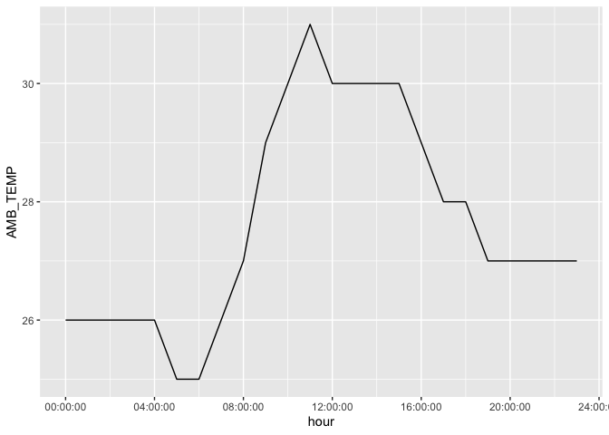
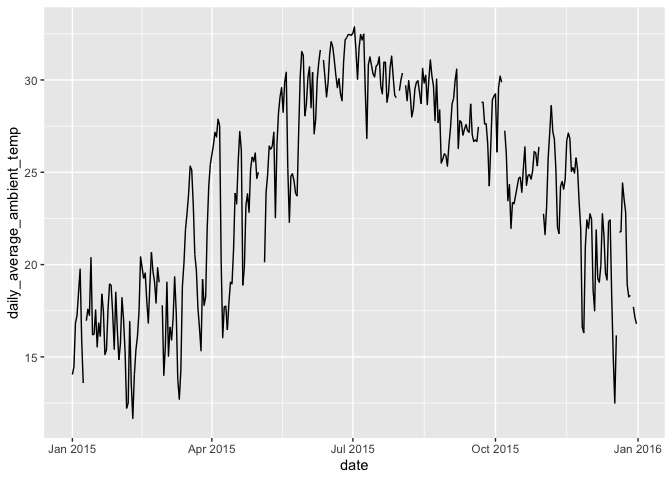
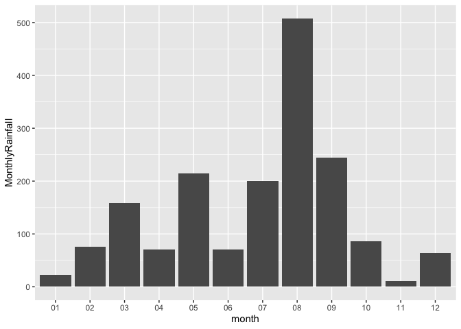
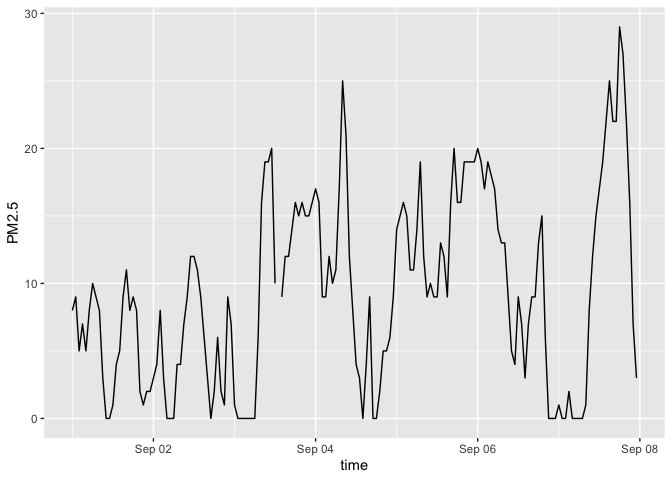

# Assignment 6: Data import and tidy data


## **Exercise 1. Tibble and Data Import**

Import the data frames listed below into R and
[parse](https://r4ds.had.co.nz/data-import.html#parsing-a-vector) the
columns appropriately when needed. Watch out for the formatting oddities
of each dataset. Print the results directly, **without** using
`kable()`.

**You only need to finish any three out of the five questions in this
exercise in order to get credit.**

  

#### **1.1 Create the following tibble manually, first using `tribble()` and then using `tibble()`. Print both results. \[We didn’t have time to cover this in class, but look up how these functions work [here](https://r4ds.had.co.nz/tibbles.html#creating-tibbles)\]**

`tribble()`:

``` r
tribble(
  ~a, ~b, ~c,
  #--|--|----
  1, 2.1, "apple",
  2, 3.2, "orange"
)
```

    # A tibble: 2 × 3
          a     b c     
      <dbl> <dbl> <chr> 
    1     1   2.1 apple 
    2     2   3.2 orange

`tibble()`:

``` r
tibble(
  x = 1:2,
  y = x + c(1.1, 1.2),
  z = c("apple", "orange")
)
```

    # A tibble: 2 × 3
          x     y z     
      <int> <dbl> <chr> 
    1     1   2.1 apple 
    2     2   3.2 orange

  

#### **1.2 Import `https://raw.githubusercontent.com/nt246/NTRES-6100-data-science/master/datasets/dataset2.txt` into R. Change the column names into “Name”, “Weight”, “Price”.**

``` r
dataset2 <- read_delim("https://raw.githubusercontent.com/nt246/NTRES-6100-data-science/master/datasets/dataset2.txt", col_names = FALSE)
dataset2 |> 
  colnames() <- c("Name", "Weight", "Price")
dataset2
```

    # A tibble: 3 × 3
      Name   Weight Price
      <chr>   <dbl> <dbl>
    1 apple       1   2.9
    2 orange      2   4.9
    3 durian     10  19.9

  

#### **1.3 Import `https://raw.githubusercontent.com/nt246/NTRES-6100-data-science/master/datasets/dataset3.txt` into R. Watch out for the first few lines, missing values, separators, quotation marks, and deliminaters.**

``` r
# library(janitor)
dataset3 <- read_delim("https://raw.githubusercontent.com/nt246/NTRES-6100-data-science/master/datasets/dataset3.txt", quote = "/", skip = 2, na = c("Not Available", "?"))
dataset3
```

    # A tibble: 3 × 3
      Name   Weight Price
      <chr>   <dbl> <dbl>
    1 apple       1   2.9
    2 orange      2  NA  
    3 durian     NA  19.9

  

#### **1.4 Import `https://raw.githubusercontent.com/nt246/NTRES-6100-data-science/master/datasets/dataset4.txt` into R. Watch out for comments, units, and decimal marks (which are `,` in this case).**

  

#### **1.5 Import `https://raw.githubusercontent.com/nt246/NTRES-6100-data-science/master/datasets/dataset5.txt` into R. Parse the columns properly. As a reminder, you can read about parsing date and time data [here](https://r4ds.had.co.nz/data-import.html#readr-datetimes). Write this imported and parsed data frame into a new csv file named `dataset5_new.csv` in your `problem_sets` folder.**

  

## **Exercise 2. Weather station**

This dataset contains the weather and air quality data collected by a
weather station in Taiwan. It was obtained from the Environmental
Protection Administration, Executive Yuan, R.O.C. (Taiwan).

#### **2.1 Variable descriptions**

This dataset contains the weather and air quality data collected by a
weather station in Taiwan. It was obtained from the Environmental
Protection Administration, Executive Yuan, R.O.C. (Taiwan).

- The text file
  `https://raw.githubusercontent.com/nt246/NTRES-6100-data-science/master/datasets/2015y_Weather_Station_notes.txt`
  contains descriptions of different variables collected by the station.

- Import it into R and print it in a table as shown below with
  `kable()`.

``` r
weather_station_notes <- read_delim("https://raw.githubusercontent.com/nt246/NTRES-6100-data-science/master/datasets/2015y_Weather_Station_notes.txt", delim = "-")
weather_station_notes |> 
kable()
```

| Item | Unit | Description |
|:---|:---|:---|
| AMB_TEMP | Celsius | Ambient air temperature |
| CO | ppm | Carbon monoxide |
| NO | ppb | Nitric oxide |
| NO2 | ppb | Nitrogen dioxide |
| NOx | ppb | Nitrogen oxides |
| O3 | ppb | Ozone |
| PM10 | μg/m3 | Particulate matter with a diameter between 2.5 and 10 μm |
| PM2.5 | μg/m3 | Particulate matter with a diameter of 2.5 μm or less |
| RAINFALL | mm | Rainfall |
| RH | % | Relative humidity |
| SO2 | ppb | Sulfur dioxide |
| WD_HR | degress | Wind direction (The average of hour) |
| WIND_DIREC | degress | Wind direction (The average of last ten minutes per hour) |
| WIND_SPEED | m/sec | Wind speed (The average of last ten minutes per hour) |
| WS_HR | m/sec | Wind speed (The average of hour) |

`#` indicates invalid value by equipment inspection

`*` indicates invalid value by program inspection

`x` indicates invalid value by human inspection

`NR` indicates no rainfall

blank indicates no data

  

#### **2.2 Data tidying**

- Import
  `https://raw.githubusercontent.com/nt246/NTRES-6100-data-science/master/datasets/2015y_Weather_Station.csv`
  into R. As you can see, this dataset is a classic example of untidy
  data: values of a variable (i.e. hour of the day) are stored as column
  names; variable names are stored in the `item` column.

- Clean this dataset up and restructure it into a tidy format.

- Parse the `date` variable into date format and parse `hour` into time.

- Turn all invalid values into `NA` and turn `NR` in rainfall into `0`.

- Parse all values into numbers.

- Show the first 6 rows and 10 columns of this cleaned dataset, as shown
  below, *without* using `kable()`.

*Hints: you don’t have to perform these tasks in the given order; also,
warning messages are not necessarily signs of trouble.*

  

Before cleaning:

``` r
taiwan_weather <- read_csv("https://raw.githubusercontent.com/nt246/NTRES-6100-data-science/master/datasets/2015y_Weather_Station.csv")
taiwan_weather
```

    # A tibble: 5,460 × 27
       date       station item    `00`  `01`   `02`   `03` `04`    `05`   `06`  `07`
       <date>     <chr>   <chr>  <dbl> <dbl>  <dbl>  <dbl> <chr>  <dbl>  <dbl> <dbl>
     1 2015-01-01 Cailiao AMB_…  16     16    15     15    15     14     14     14  
     2 2015-01-01 Cailiao CO      0.74   0.7   0.66   0.61 0.51    0.51   0.51   0.6
     3 2015-01-01 Cailiao NO      1      0.8   1.1    1.7  2       1.7    1.9    2.4
     4 2015-01-01 Cailiao NO2    15     13    13     12    11     13     13     16  
     5 2015-01-01 Cailiao NOx    16     14    14     13    13     15     15     18  
     6 2015-01-01 Cailiao O3     35     36    35     34    34     32     30     26  
     7 2015-01-01 Cailiao PM10  171    174   160    142    123   110    104    104  
     8 2015-01-01 Cailiao PM2.5  76     78    69     60    52     44     40     41  
     9 2015-01-01 Cailiao RAIN…  NA     NA    NA     NA    NR     NA     NA     NA  
    10 2015-01-01 Cailiao RH     57     57    58     59    59     57     57     56  
    # ℹ 5,450 more rows
    # ℹ 16 more variables: `08` <chr>, `09` <chr>, `10` <chr>, `11` <chr>,
    #   `12` <chr>, `13` <chr>, `14` <chr>, `15` <chr>, `16` <chr>, `17` <chr>,
    #   `18` <chr>, `19` <dbl>, `20` <chr>, `21` <dbl>, `22` <dbl>, `23` <dbl>

  

After cleaning:

``` r
taiwan_weather_clean <- read_csv("https://raw.githubusercontent.com/nt246/NTRES-6100-data-science/master/datasets/2015y_Weather_Station.csv", col_names = TRUE, guess_max = Inf)
taiwan_weather_clean2 <- taiwan_weather_clean |> 
  pivot_longer(cols = c("00":"23"), names_to = "hour", values_to = "value") |> 
  pivot_wider(names_from = item, values_from = value) |> 
  mutate(date = as.Date(date), across(AMB_TEMP:PM10, as.numeric), hour = hms::as_hms(paste0(hour, ":00:00")))

taiwan_weather_clean2 |> 
  select(1:10) |> 
  head()
```

    # A tibble: 6 × 10
      date       station hour   AMB_TEMP    CO    NO   NO2   NOx    O3  PM10
      <date>     <chr>   <time>    <dbl> <dbl> <dbl> <dbl> <dbl> <dbl> <dbl>
    1 2015-01-01 Cailiao 00:00        16  0.74   1      15    16    35   171
    2 2015-01-01 Cailiao 01:00        16  0.7    0.8    13    14    36   174
    3 2015-01-01 Cailiao 02:00        15  0.66   1.1    13    14    35   160
    4 2015-01-01 Cailiao 03:00        15  0.61   1.7    12    13    34   142
    5 2015-01-01 Cailiao 04:00        15  0.51   2      11    13    34   123
    6 2015-01-01 Cailiao 05:00        14  0.51   1.7    13    15    32   110

  

#### **2.3 Using this cleaned dataset, plot the daily variation in ambient temperature on September 25, 2015, as shown below.**

``` r
taiwan_weather_clean2 |> 
  filter(date == "2015-09-25") |> 
  ggplot(aes(x = hour, y = AMB_TEMP)) +
  geom_line()
```



  

#### **2.4 Plot the daily average ambient temperature throughout the year with a continuous line, as shown below.**

``` r
taiwan_weather_clean2 |> 
  group_by(date) |> 
  mutate(daily_average_ambient_temp = mean(AMB_TEMP)) |> 
  ggplot(aes(x = date, y = daily_average_ambient_temp)) +
  geom_line()
```



  

#### **2.5 Plot the total rainfall per month in a bar chart, as shown below.**

*Hint: separating date into three columns might be helpful.*

``` r
taiwan_weather_clean2 |> 
  mutate(year = format(date, "%Y"), month = format(date, "%m"), day = format(date, "%d"), RAINFALL = as.numeric(RAINFALL)) |> 
  group_by(month) |> 
  summarise(MonthlyRainfall = sum(RAINFALL, na.rm = TRUE)) |> 
  ggplot(aes(x = month, y = MonthlyRainfall)) +
  geom_col()
```



  

#### **2.6 Plot the per hour variation in PM2.5 in the first week of September with a continuous line, as shown below.**

*Hint: uniting the date and hour and parsing the new variable might be
helpful.*

``` r
taiwan_weather_clean2 |>
  filter(format(date, "%m") == "09", format(date, "%d") <= "07") |> 
  mutate(time_str = paste(date, hour), PM2.5 = as.numeric(PM2.5)) |> 
  mutate(time = parse_datetime(time_str, format = "%Y-%m-%d %H:%M:%S")) |> 
  ggplot(aes(x = time, y = PM2.5)) +
  geom_line()
```



  

## **Exercise 3. Camera data (OPTIONAL)**

This dataset contains information on 1038 camera models. It was obtained
from the following website:
<https://perso.telecom-paristech.fr/eagan/class/igr204/>

  

#### **3.1 Split brand names and model names**

- Import
  `https://raw.githubusercontent.com/nt246/NTRES-6100-data-science/master/datasets/camera.csv`
  to R.

- You will see that the `Model` columns contains both the brand names
  and model names of cameras. Split this column into two, one with brand
  name, and the other with model name, as shown below.

- Print the first 6 rows of the new data frame with `kable()`.

*Hint: check the merge argument in `separate()`*

  

#### 3.2 Split product line names and model names

- Many model names start with a name for the product line, which is then
  followed by a name for the particular model.

- Select all Canon cameras, and further split the model names into
  product line names (in this case, they are either “Powershot” or
  “EOS”) and model names.

- Show the first 6 lines of this new data frame with `kable()`.

*Hint: notice that there are more than one possible separators.*

  
